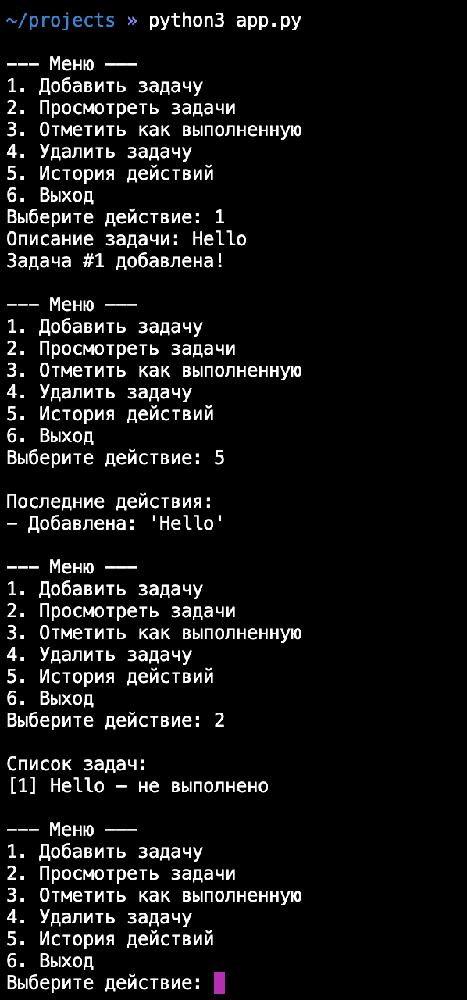

# Git
1. Ознакомиться с микро-уроками
- https://youtu.be/0ZGPADQf29Q
- https://youtu.be/-kegdnmqM5U
- https://youtu.be/dDeediJRUPE
- https://youtu.be/JuF57RoP-FU

Как работать с ssh на винде - https://www.theserverside.com/blog/Coffee-Talk-Java-News-Stories-and-Opinions/GitHub-SSH-Windows-Example

2. Зарегистрироваться на github и создать там публичный репозиторий для кода, все дальнейшие домашки пушить в него
# Разминка
1) Создать словарь `student` с ключами: `"name"`, `"age"`, `"subjects"` (список из 3 предметов). Вывести предмет с индексом 1; добавить в словарь `student` новый ключ: `"grade"` со значением `"A"`. Затем удалить ключ `"age"` и вывести итоговый словарь на экран
2) Создать словарь с данными о книгах:
```python
books = {
    "1984": {"author": "George Orwell", "year": 1949},
    "Brave New World": {"author": "Aldous Huxley", "year": 1932}
}
```
Добавить новую книгу `"Fahrenheit 451"` (автор: Ray Bradbury, год: 1953). Обновить год для `"1984"` на 1948
3) Для списка словарей с данными о товарах
```python
products = [
    {"id": 1, "price": 100, "category": "A"},
    {"id": 2, "price": 200, "category": "B"},
    {"id": 3, "price": 50, "category": "A"},
    {"id": 4, "price": 1000, "category": "C"},
    {"id": 5, "price": 250, "category": "A"},
    {"id": 6, "price": 500, "category": "B"},
    {"id": 7, "price": 200, "category": "C"},
    {"id": 8, "price": 4500, "category": "B"}
]
```
Рассчитать:
- Среднюю цену по категориям
- Самый дорогой товар в каждой категории
- Общую стоимость всех товаров
4) Дан список слов. Создать словарь, где ключ — это слово, а значение — количество раз, которое это слово встречается в списке (регистр НЕ учитывать). Например
```
fruits = ["apple", "banana", "Apple", "banana", "cherry"]
fruits_stat = {}
# код тут
print(fruits_stat)

{"apple": 2, "banana": 2, "cherry": 1}
```
# Микро-проект
Реализовать консольное приложение для управления задачами (а-ля ToDo)
### **Функционал**
1. Добавление задачи
2. Просмотр всех задач
3. Отметка задачи как выполненной
4. Удаление задачи
5. Выход из программы

### **Требования к реализации**
1. **Словарь** для хранения задач (ключ: `id`, значение: словарь с `описанием` и `статусом`)
2. **Список** для хранения истории операций (последние 5 действий)
3. **Цикл** для работы меню
4. **Условия** для обработки выбора пользователя
5. **Переменные** для управления состоянием системы

### Пример работы
